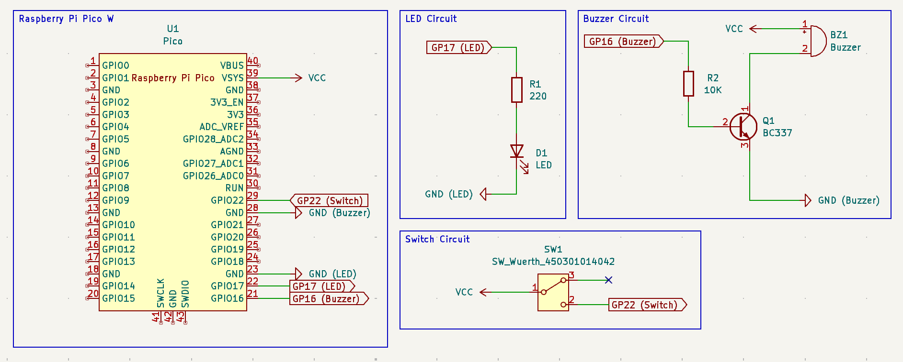

# PonderadaPCB

## Gustavo Wagon Widman

Esse repositório contém o código fonte da PCB desenvolvida para uma atividade ponderada. A atividade tem por objetivo desenvolver uma placa de circuito impresso capaz de receber um Raspberry Pi Pico W encaixado utilizando um dispositivo conector, além de um hardware para acionar uma interface de potência (relé e transistor), um dispositivo sinalizador (LED ou Buzzer) e um dispositivo de entrada (analógico ou digital). O projeto foi desenvolvido utilizando o software KiCad.

## Descrição do Projeto

O projeto foi desenvolvido utilizando o software KiCad. A placa de circuito impresso foi desenvolvida para ser utilizada em conjunto com um Raspberry Pi Pico W. A placa possui um conector para encaixe do Raspberry Pi Pico W, e diversos pequenos circuitos:

- Switch para interface de entrada: O switch é conectado ao pino GP22 do Raspberry Pi Pico W e pode ser utilizado para acionar um evento no software rodando no Raspberry Pi Pico W.
- LED para interface de saída: O LED é conectado ao pino GP17 do Raspberry Pi Pico W e pode ser controlado pelo software rodando no Raspberry Pi Pico W.
- Transistor conectado a um buzzer: O transistor é conectado ao pino GP16 do Raspberry Pi Pico W e pode ser utilizado para ativar e desativar um buzzer.

## Estrutura do Projeto

```bash
.
├── README.md
├── assets
│   ├── 3D.png
│   ├── PCB.png
│   └── Schematic.png
└── src
    ├── PonderadaPCB.kicad_pcb
    ├── PonderadaPCB.kicad_pro
    ├── PonderadaPCB.kicad_sch
    └── gerber
        ├── PonderadaPCB-B_Cu.gbr
        ├── PonderadaPCB-B_Mask.gbr
        ├── PonderadaPCB-B_Paste.gbr
        ├── PonderadaPCB-B_Silkscreen.gbr
        ├── PonderadaPCB-Edge_Cuts.gbr
        ├── PonderadaPCB-F_Cu.gbr
        ├── PonderadaPCB-F_Mask.gbr
        ├── PonderadaPCB-F_Paste.gbr
        ├── PonderadaPCB-F_Silkscreen.gbr
        └── PonderadaPCB-job.gbrjob
```

A pasta `assets` contém imagens do projeto (demonstradas neste arquivo README). A pasta `src` contém os arquivos do projeto KiCad, incluindo o esquemático, a PCB e os arquivos gerber para fabricação da placa de circuito impresso, que estão localizados na pasta `gerber` (dentro da pasta `src`).

## Imagens do Projeto

### Esquemático



### PCB


### 3D


## Lista de Materiais

| Componente          | Footprint                                         | Quantidade |
| ------------------- | ------------------------------------------------- | ---------- |
| Raspberry Pi Pico W | RPi_Pico_SMD_TH                                   | 1          |
| Switch              | SW_Slide-03_Wuerth-WS-SLTV_10x2.5x6.4_P2.54mm     | 1          |
| LED                 | LED_D5.0mm                                        | 1          |
| Transistor          | TO-92_Inline                                      | 1          |
| Buzzer              | Buzzer_15x7.5RM7.6                                | 1          |
| Resistor 220 Ohm    | R_Axial_DIN0207_L6.3mm_D2.5mm_P15.24mm_Horizontal | 1          |
| Resistor 10k Ohm    | R_Axial_DIN0207_L6.3mm_D2.5mm_P15.24mm_Horizontal | 1          |
